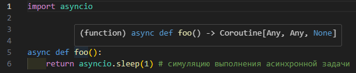

# Асинхронное программирвоание

В целом асинхронное программирование появилось не так давно, как библиотека asyncio в версии 3.4 а ключевые слова async и await в версии 3.5.

Для начала может быть абсолютно не понятно в чём разница меджу def и async def но дальше на пример разберёмся.


# async

Прежде чем обращать к асинхронным функциям нужно понять как эти функции создавать и что они возвращают.

Все асинхронные функции должны быть обозначены ключевым словом async. Это позволяет питону понять что это асинхронная функция и её нужно запускать в асинхронном режиме.

```python
import asyncio

async def foo():
    return asyncio.sleep(1) # симуляцию выполнения асинхронной задачи

async def main():
    await foo()
```

Если мы посмотрим на возвращаемый тип данных функции foo через любую среду разработки, она скажет нам о том что это корутина.



Corutine - это специальный тип функции который позволяет питону понять, что нужно запускать функцию в асинхронном режиме благодаря ключевому словую ```await```. Это позволяет питону выполнять несколько функций одновременно и не блокировать выполнение программы.


Асинхронное программирование имеет своё начало из [конкурентного и параллельного программирования](./parallel.md).

Смысл использования асинхронного программирования в питоне в том, что обычно питон блокирует выполнение программы на выполнение функции. Например, если у вас есть функция которая выполняется 10 секунд, то весь код который идёт после этой функции будет выполняться только после выполнения этой функции. Это не всегда удобно, поэтому и появилось асинхронное программирование в котором задачи которые не зависят друг от друга могут выполняться не блокируя выполнение все программы целиком.

Лучший пример который я знаю, это касса в маке. Можно работать одному, и сначала взять заказ, потом его приготовить, потом его отдать - это синхронное выполнение. А можно взять заказ, отдать его на кухню, и пока он готовится, слушать следующий заказ(а люди не всегда мгновенно называют что они хотят, они любят потупить за кассой).

# await

Ключевое слово await используется для ожидания выполнения асинхронной функции. Это позволяет питону понять что нужно остановить выполнение программы и дождаться выполнения этой функции.

```python
import asyncio

async def foo():
    return asyncio.sleep(1) # симуляцию выполнения асинхронной задачи

async def main():
    await foo()
```

В данном примере функция main остановит выполнение программы и дождётся выполнения функции foo. После выполнения foo программа продолжит выполнение.

# Пример

```python
import asyncio

async def foo():
    print('foo')
    await asyncio.sleep(1)
    print('foo done')

async def bar():
    print('bar')
    await asyncio.sleep(2)
    print('bar done')

async def main():
    await asyncio.gather(foo(), bar())
```